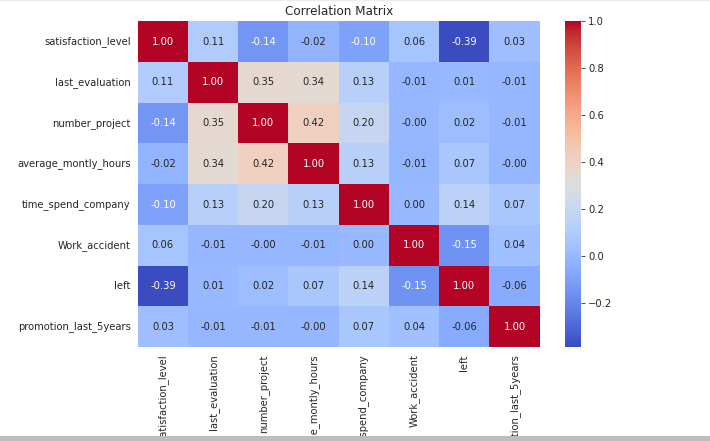
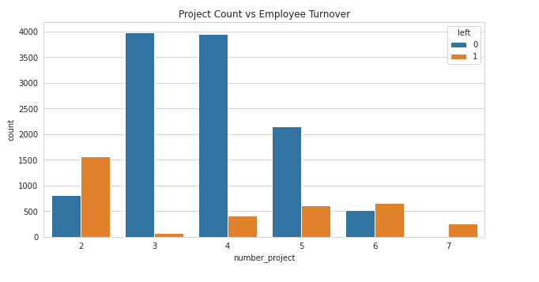
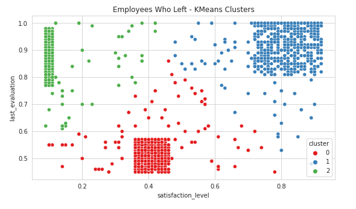
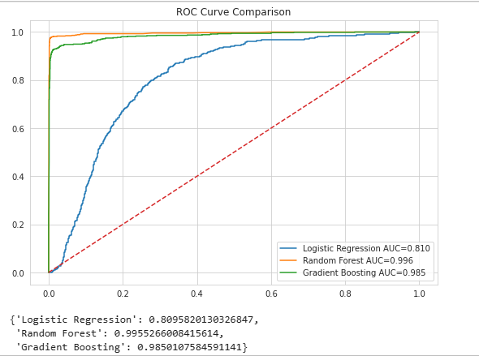
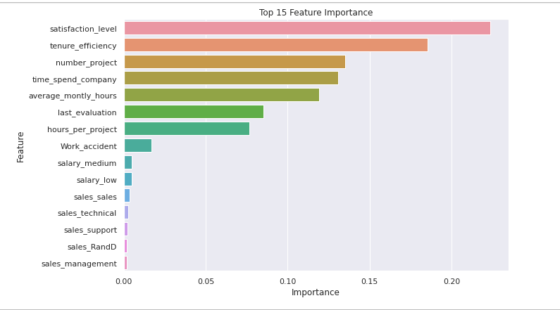
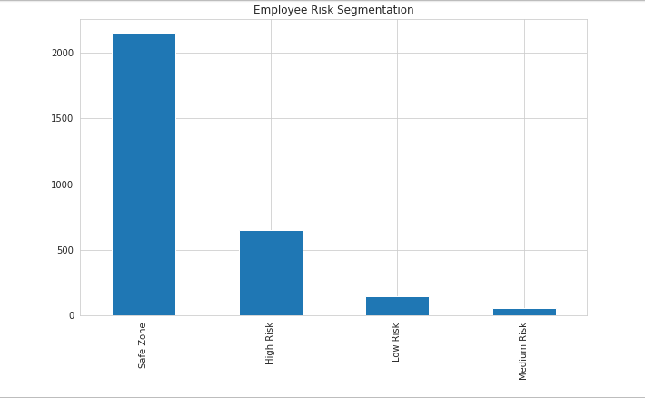

# Employee Turnover Intelligence System

## Overview

Employee turnover is one of the most critical challenges faced by organizations today. High employee attrition increases recruitment costs, reduces productivity, affects team morale, and disrupts business continuity.

This project develops an end-to-end Machine Learning solution capable of predicting employee turnover, identifying key factors influencing attrition, segmenting employees based on behavioral patterns, and providing actionable retention strategies.

The project combines Exploratory Data Analysis (EDA), Employee Segmentation, Class Imbalance Handling, Machine Learning Model Development, Cross-Validation, Hyperparameter Optimization, and Risk-Based Employee Retention Analytics.

---

## Business Problem

Organizations often struggle to identify employees who are likely to resign before it is too late. Traditional HR monitoring approaches rely heavily on manual assessments and subjective judgments.

The objective of this project is to:

* Predict employee turnover using historical HR data
* Identify the major drivers of attrition
* Segment employees based on satisfaction and evaluation patterns
* Develop a risk scoring framework
* Recommend targeted retention strategies

---

## Dataset

The dataset contains employee information including:

| Feature               | Description                               |
| --------------------- | ----------------------------------------- |
| satisfaction_level    | Employee satisfaction score               |
| last_evaluation       | Performance evaluation score              |
| number_project        | Number of projects assigned               |
| average_montly_hours  | Average monthly working hours             |
| time_spend_company    | Years spent in the company                |
| Work_accident         | Whether employee had a workplace accident |
| promotion_last_5years | Promotion status                          |
| Department            | Employee department                       |
| salary                | Salary category                           |
| left                  | Target variable indicating turnover       |

Dataset Source:
https://www.kaggle.com/liujiaqi/hr-comma-sepcsv

---

## Project Workflow

### 1. Data Quality Assessment

* Missing value analysis
* Duplicate record detection
* Data type validation
* Feature inspection

### 2. Exploratory Data Analysis

Performed extensive EDA to understand employee behavior patterns.

Key visualizations include:

* Correlation Heatmap
* Employee Satisfaction Distribution
* Employee Evaluation Distribution
* Monthly Working Hours Distribution
* Project Count Analysis
* Employee Turnover Distribution

---

## Employee Segmentation

Employees who left the company were segmented using K-Means Clustering.

Features used:

* Satisfaction Level
* Last Evaluation Score

Three clusters were identified:

### Cluster 1

Low satisfaction employees with poor engagement.

### Cluster 2

High-performing employees experiencing burnout.

### Cluster 3

Moderately satisfied employees showing declining commitment.

These insights can help HR teams design cluster-specific interventions.

---

## Feature Engineering

Additional features were engineered to improve predictive performance.

### Hours Per Project

Measures workload intensity.

hours_per_project = average_monthly_hours / number_project

### Tenure Efficiency

Measures the interaction between employee performance and company tenure.

tenure_efficiency = last_evaluation × time_spend_company

Feature engineering helps capture hidden relationships that are not directly represented in the original dataset.

---

## Class Imbalance Handling

Employee turnover datasets are naturally imbalanced because most employees stay with the company.

To address this issue:

* Stratified Train-Test Split
* SMOTE (Synthetic Minority Oversampling Technique)

SMOTE generated synthetic examples of turnover cases, allowing the models to learn minority-class patterns more effectively.

---

## Machine Learning Models

The following models were evaluated:

### Logistic Regression

Baseline interpretable model.

### Random Forest Classifier

Ensemble tree-based model with strong predictive capability.

### Gradient Boosting Classifier

Sequential boosting model optimized for classification performance.

---

## Model Validation

A 5-Fold Stratified Cross Validation strategy was used to ensure robust model evaluation.

Evaluation metrics:

* Accuracy
* Precision
* Recall
* F1 Score
* ROC-AUC

---

## Hyperparameter Optimization

GridSearchCV was used to optimize Random Forest hyperparameters including:

* Number of Trees
* Maximum Tree Depth

This process improved model generalization and predictive performance.

---

## Model Performance

Model performance was compared using:

* ROC Curves
* AUC Scores
* Confusion Matrices
* Classification Reports

The best-performing model was selected based on overall predictive effectiveness and turnover detection capability.

---

## Feature Importance Analysis

Feature importance analysis was performed using the best tree-based model.

Top factors influencing employee turnover include:

* Satisfaction Level
* Number of Projects
* Average Monthly Hours
* Time Spent in Company
* Last Evaluation Score

Understanding these factors enables HR departments to proactively address turnover risks.

---

## Employee Risk Scoring System

Employees were categorized into four risk groups based on predicted turnover probability.

| Risk Zone        | Probability Range |
| ---------------- | ----------------- |
| Safe Zone        | < 20%             |
| Low Risk Zone    | 20% - 60%         |
| Medium Risk Zone | 60% - 90%         |
| High Risk Zone   | > 90%             |

---

## Retention Strategy Framework

### Safe Zone (Green)

* Maintain engagement
* Continue recognition programs
* Encourage professional development

### Low Risk Zone (Yellow)

* Conduct career growth discussions
* Offer skill development opportunities

### Medium Risk Zone (Orange)

* Review workload allocation
* Improve manager-employee communication
* Assess compensation competitiveness

### High Risk Zone (Red)

* Immediate HR intervention
* Personalized retention plans
* Promotion and role redesign assessment

---

## Screenshots

## Correlation Analysis

## Employee Turnover Distribution

## Employee Segmentation Using K-Means

## ROC-AUC Model Comparison

## Feature Importance Analysis

## Employee Risk Segmentation

---

## Technologies Used

* Python
* Pandas
* NumPy
* Matplotlib
* Seaborn
* Scikit-Learn
* Imbalanced-Learn (SMOTE)
* Jupyter Notebook

---

## Project Structure

employee-turnover-intelligence-system/

├── data/

├── images/

├── notebooks/

├── reports/

├── README.md

├── requirements.txt

└── LICENSE

---

## Key Outcomes

* Developed an end-to-end employee turnover prediction pipeline.
* Successfully handled class imbalance using SMOTE.
* Built multiple machine learning models and compared performance.
* Identified important drivers of employee attrition.
* Designed a practical employee risk scoring framework.
* Proposed actionable retention strategies for HR decision-making.

---

## Future Enhancements

* SHAP Explainability
* XGBoost Integration
* Streamlit Dashboard
* Power BI Dashboard
* Real-Time Prediction API
* Employee Retention Recommendation System

---

## Author

Abdul Samad Shaikh

Machine Learning | Data Science | Predictive Analytics
